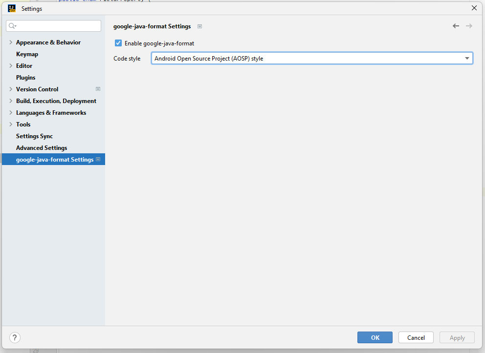

# Step 3: Using JabRef's code style

Contributions to JabRef's source code need to have a code formatting that is consistent with existing source code.
For that purpose, JabRef relies on both the [Google Java Style Guide](https://google.github.io/styleguide/javaguide.html) and [checkstyle](https://checkstyle.sourceforge.io/).

## Google Java Style (AOSP)

### Install google-java-format plugin

Install the [google-java-format IDEA plugin](https://plugins.jetbrains.com/plugin/8527-google-java-format):
Navigate to **File > Settings... > Plugins"**.
On the top, click on "Marketplace".
Then, search for "google-java-format".
Click on "Install".

### Configure google-java-format plugin

JabRef likes to have 4 spaces indentation.
This is called the "AOSP" style in the Google Java Format style.
Navigate to **File > Settings... > google-java-format Settings"**.
Change "Code style" to "Android Open Source Project (AOSP) style".





## Checkstyle

## Install checkstyle plugin

Install the [CheckStyle-IDEA plugin](http://plugins.jetbrains.com/plugin/1065?pr=idea), it can be found via the plug-in repository:
Navigate to **File > Settings... > Plugins"**.
On the top, click on "Marketplace".
Then, search for "Checkstyle".
Click on "Install" choose "CheckStyle-IDEA".





After clicking, IntelliJ asks for confirmation:





If you agree, click on "Agree" and you can continue.

Afterwards, use the "Restart IDE" button to restart IntelliJ.





Click on "Restart" to finally restart.

### Put JabRef's checkstyle configuration in place

Now, put the checkstyle configuration file is in place:

Go to **File > Settings... > Tools > Checkstyle > Configuration File**

Trigger the import dialog of a CheckStyle style by clicking the \[+] button:





Then:

* Put "JabRef" as description.
* Browse for `config/checkstyle/checkstyle.xml`
* Tick "Store relative to project location"
* Click "Next"





Click on "Finish"

Activate the CheckStyle configuration file by ticking it in the list





Ensure that the [latest CheckStyle version](https://checkstyle.org/releasenotes.html) is selected (10.3.4 or higher).
Also, set the "Scan Scope" to "Only Java sources (including tests)".





Save settings by clicking "Apply" and then "OK"

In the lower part of IntelliJ's window, click on "Checkstyle".
In "Rules", change to "JabRef".
Then, you can run a check on all modified files.





## Enable proper import cleanup

To enable "magic" creation and auto cleanup of imports, go to **File > Settings... > Editor > General > Auto Import**.
There, enable both "Add unambiguous imports on the fly" and "Optimize imports on the fly"
(Source: [JetBrains help](https://www.jetbrains.com/help/idea/creating-and-optimizing-imports.html#automatically-add-import-statements)).





Press "OK".

## Disable too advanced code folding

Go to **File > Settings... > Editor > General > Code Folding**.
At "Java", disable "General > File header", "General > Imports", and "Java > One-line methods".





Press "OK".

## Final comments

{: .highlight }
> Now you have configured IntelliJ completely.
> You can run the main application using Gradle and the test cases using IntelliJ.
> The code formatting rules are imported - and the most common styling issue at imports is automatically resolved by IntelliJ.
> Finally, you have Checkstyle running locally so that you can check for styling errors before submitting the pull request.

Got it running? GREAT! You are ready to lurk the code and contribute to JabRef. Please make sure to also read our [contribution guide](https://devdocs.jabref.org/contributing#contribute-code).
